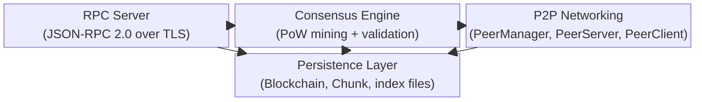
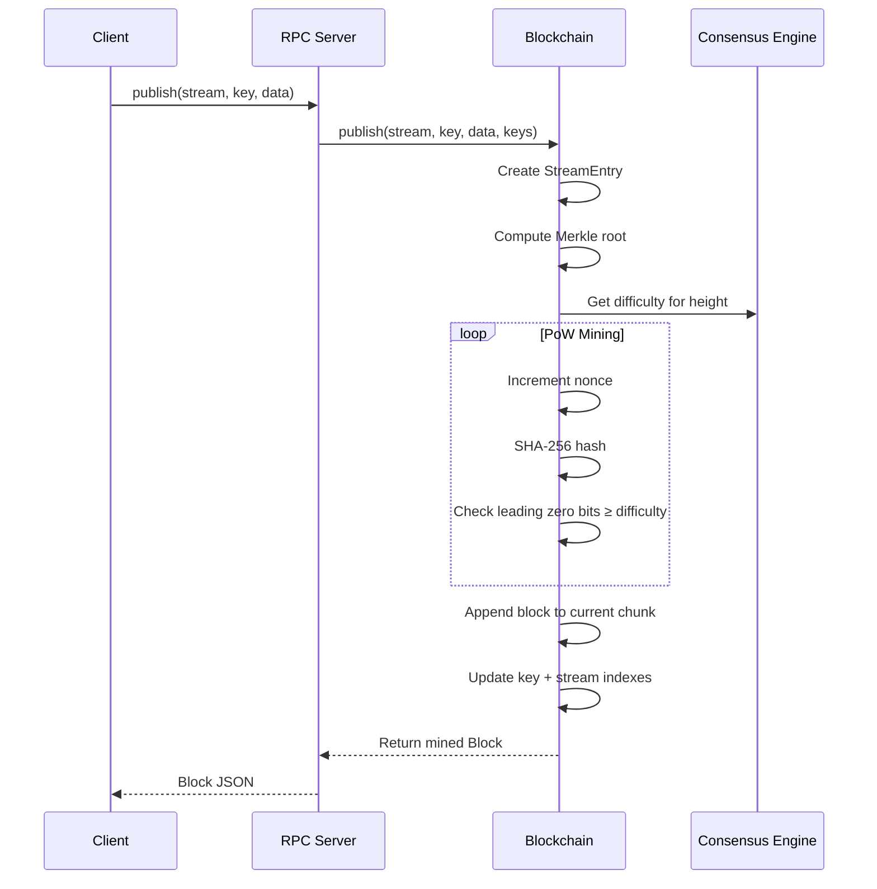
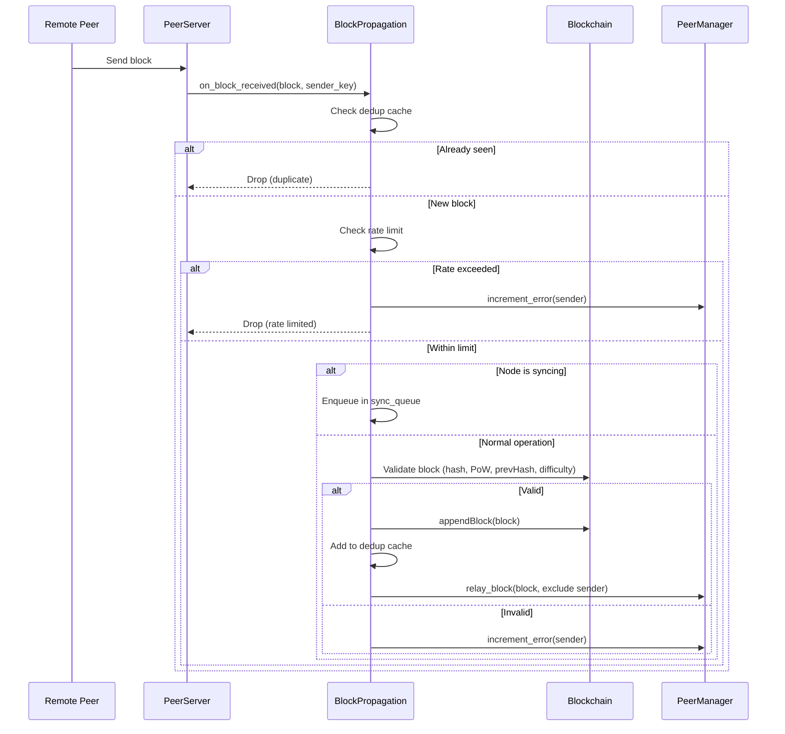
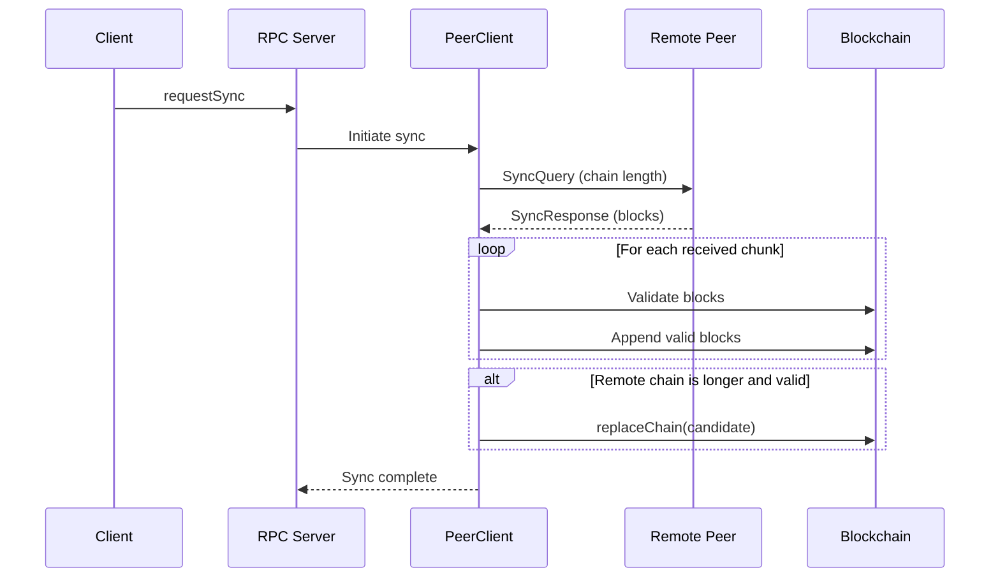
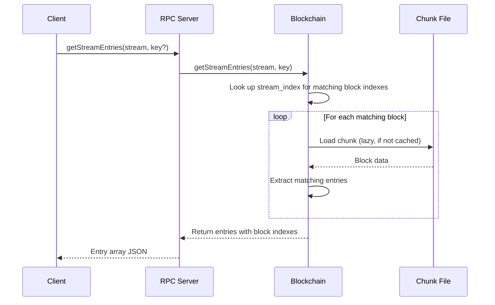

# Architecture Overview

This document describes the blockchain node's major subsystems, their responsibilities, and the key data flows.

## Table of Contents

- [System Overview](#system-overview)
- [Consensus Engine](#consensus-engine)
- [P2P Networking](#p2p-networking)
- [Persistence Layer](#persistence-layer)
- [RPC Server](#rpc-server)
- [Data Flows](#data-flows)
  - [Block Mining](#block-mining)
  - [Block Propagation](#block-propagation)
  - [Chain Synchronization](#chain-synchronization)
  - [Stream Query](#stream-query)

## System Overview

The node is composed of four major subsystems that cooperate through shared interfaces:

- **RPC Server** — exposes the JSON-RPC 2.0 API over TLS for external clients
- **Consensus Engine** — implements Proof-of-Work mining and block validation
- **P2P Networking** — manages peer connections, block propagation, and chain sync
- **Persistence Layer** — stores blocks in chunk files, manages indexes and recovery

## Consensus Engine

The consensus engine implements Proof-of-Work with automatic difficulty adjustment.

**Mining**: When a stream entry is published, the engine creates a new block containing the entry, computes a Merkle root over the entries, and searches for a nonce that produces a SHA-256 hash with a required number of leading zero bits (the "difficulty"). Mining is subject to a configurable timeout.

**Difficulty adjustment**: After every `adjustment_window` blocks, the engine compares the actual time elapsed against the target interval. The difficulty change uses a log₂ ratio clamped to `max_adjustment_factor`, keeping block times near `target_block_interval`. Difficulty is bounded between `min_difficulty` and `max_difficulty`.

**Validation**: Received blocks are validated for correct hash, valid PoW, sequential index, matching `prevHash`, reasonable timestamp, and correct difficulty for their height. The longest valid chain wins; reorganization depth is limited to `max_reorg_depth`.

Key source files: `ConsensusConfig.hpp`, `Blockchain.hpp`, `Block.hpp`

## P2P Networking

The node uses a dual-port model:

- **RPC port** (default 12345) — JSON-RPC 2.0 over TLS for client applications
- **P2P port** (default 12346) — binary protocol over mutual TLS for peer communication

### PeerManager

Central coordinator for peer lifecycle. Manages connection limits (inbound/outbound), persists peer state to `peers.json`, assigns a unique node UUID, and orchestrates peer exchange gossip at configurable intervals.

### PeerServer

Accepts inbound P2P connections. Handles block reception, sync queries, and peer exchange messages from remote nodes.

### PeerClient

Makes outbound P2P connections to known peers. Sends sync queries, relays blocks, and participates in peer exchange. Implements exponential backoff for reconnection attempts.

### Peer Exchange & Discovery

Peers periodically broadcast their known peer lists via gossip. New peers discovered through exchange are added to the peer list (up to `max_stored_peers`). Self-connections are filtered by node UUID.

### Ban System

Peers that accumulate too many protocol errors (≥ `ban_threshold_errors`) are automatically banned. Bans expire after `ban_duration_seconds`. Bans can also be applied and removed manually via RPC.

Key source files: `PeerManager.hpp`, `PeerConfig.hpp`, `network/PeerServer.cpp`, `network/PeerClient.cpp`

## Persistence Layer

### Chunk-Based Storage

Blocks are stored in chunk files (`chunk_NNNNNN.dat`), each holding up to 100 blocks. Chunks use Boost.Serialization binary archives. When a chunk reaches capacity, a new chunk file is created automatically.

### Lazy Loading & Dirty Tracking

Chunks are loaded on demand when blocks within them are accessed. Each chunk tracks whether it has been modified (dirty). On shutdown, only dirty chunks are saved, minimizing I/O. Periodic saves run at a configurable interval.

### Index Files

- `keys.dat` — maps keys to block indexes for `getBlocksByKeys` queries
- `streams.dat` — stream registry (set of known stream names)
- `stream_index.dat` — maps (stream, key) pairs to block indexes for stream queries

### Recovery

On startup, the node discovers all chunk files, loads and validates them, verifies cross-chunk hash linkage, and rebuilds indexes. The `fast_startup` option skips full validation for faster startup at the cost of reduced safety.

Key source files: `Blockchain.hpp`, `Chunk.hpp`, `IChunk.hpp`

## RPC Server

The RPC server implements JSON-RPC 2.0 over TLS. It accepts HTTPS connections, parses JSON-RPC requests, dispatches to the appropriate handler, and returns JSON-RPC responses.

**Sync awareness**: During chain synchronization, the `publish` method is blocked to prevent conflicts. Other read methods remain available.

**Session handling**: Each RPC connection is handled as an independent TLS session. There is no authentication beyond TLS — any client with the CA certificate can connect.

The server exposes 20 methods organized into 6 groups: Streams, Blocks, Peers, Node, Merkle, and Sync. See [docs/rpc-api.md](rpc-api.md) for the complete reference.

Key source files: `network/RpcServer.cpp`

## Data Flows

### Block Mining

When a client publishes a stream entry, the node mines a new block and persists it:

### Block Propagation

When a block is received from a peer, it goes through dedup, rate limiting, and validation before being persisted and relayed:

### Chain Synchronization

A node behind the network triggers a sync to catch up:

### Stream Query

Querying stream entries uses the stream index for efficient lookup:

